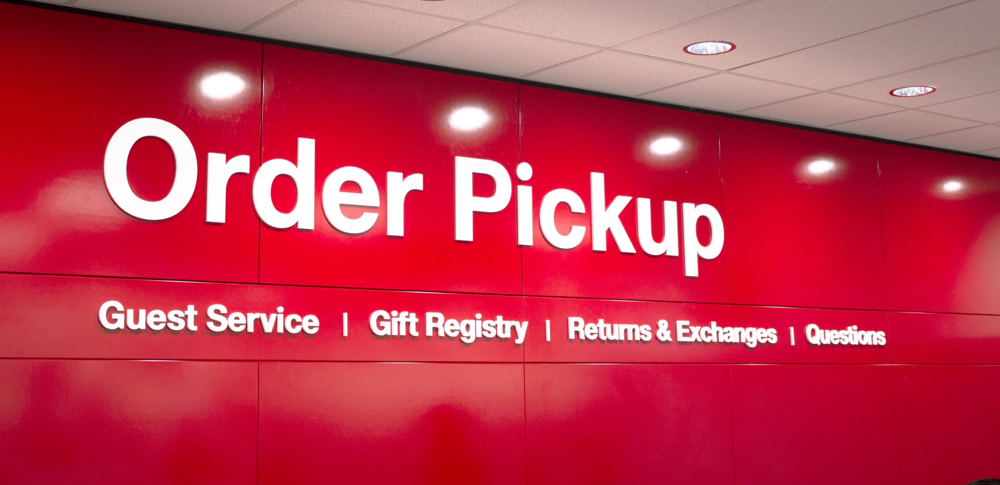

# Retail Displays — In-Store Signage and Display Engineering at Excel Plastics

> *In-store signage for Target, in-aisle displays for Best Buy, makeup displays for Sephora, and other retail-environment fixtures designed and engineered during my Excel Plastics tenure (Dec 2015 – Nov 2017).*

*Installed in-store order-pickup signage: a finished retail environment where plastic fabrication, typography, mounting, lighting, and brand constraints all have to resolve into something customers can read instantly.*

## What this is

A documentation piece — the work I did as a **Design Engineer at Excel Plastics** in Minneapolis, MN, designing in-store signage, in-aisle displays, makeup-counter fixtures, and other retail-environment plastics for major national clients including **Target, Best Buy, Sephora**, and others.

This repository is a **portfolio piece**, not an open hardware project. The display designs were Excel Plastics work-for-hire on behalf of the named clients; **the underlying designs and any related drawings are the property of Excel Plastics and the respective clients.** See [`NOTICE.md`](NOTICE.md).

The displays themselves were *seen by millions of shoppers* in stores across North America during their deployment, so the finished work is fully public — it's the underlying CAD and process documentation that remains proprietary.

## What you'll find

- **Photos of finished displays** that I took on-site or that were publicly distributed.
- **Brief writeups** of the engineering challenges in each project (acrylic and thermoplastic fabrication, custom in-store displays, large-format signage, mass-production of consumer-touching fixtures).
- **My role** as Design Engineer — the design lifecycle from concept through prototyping and release to production.

## What you won't find

- Excel Plastics' or any client's CAD files or drawings.
- Pre-launch concept art or proprietary process documentation.
- Specific cost or contract data.

## Project highlights

> *(Forthcoming — short writeups per major project.)*

*Acrylic-and-aluminum point-of-purchase display fixture for the XCRAFT XPlusOne quadcopter — backlit pedestal, integrated promotional video screen, branded header signage, and three-drawer storage base.*

- **Target — in-store signage** *(forthcoming)*
- **Best Buy — in-aisle displays** *(forthcoming)*
- **Sephora — makeup-counter displays** *(forthcoming)*
- **Other retail clients** *(forthcoming)*

## License & rights

See [`NOTICE.md`](NOTICE.md). Original written content and photographs *I have the right to publish* are released under [CC-BY 4.0](LICENSE).

## Status

| Section | Status |
|---|---|
| Repo description, license, NOTICE, gitignore | ✓ done |
| Project writeups | forthcoming |
| Curated display photos | forthcoming (from `Engineering Portfolio/` 2016 era) |
| Hero image | forthcoming |
